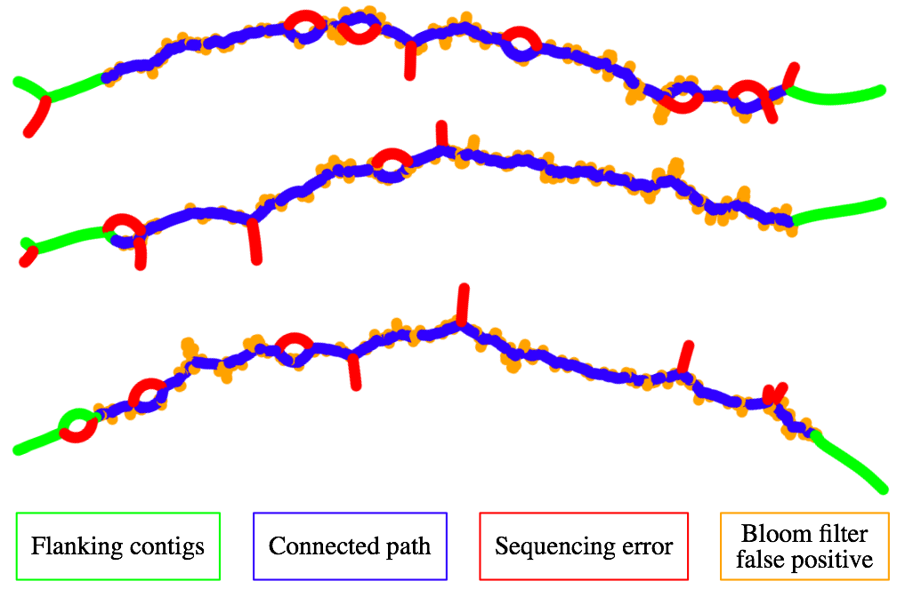

[\@sjackman](https://twitter.com/sjackman) — <http://sjackman.ca>

Abstract
================================================================================

+ Longer reads require larger values of *k* for de Bruijn Graph (dBG) assembly
+ Larger *k* usually require more memory
+ ABySS uses two memory-efficient data structures
    - Spaced-seed dBG
    - Bloom filter dBG
+ whose memory usage is independent of *k*
+ Suitable for assembly of
    - Overlapping paired MiSeq
    - Moleculo
    - Corrected Oxford Nanopore

Methods
================================================================================

+ **Spaced seed dBG** stores the first and last few nucleotides of each *k*-mer
+ For example, a 364-mer of two 32-mer separated by a 300 nucleotide gap
+ Uses a fraction the memory of standard dBG
+ **ABySS-Sealer** fills scaffold gaps
+ Navigates a path between contigs through a Bloom filter dBG
+ Memory efficiency permits using multiple Bloom filter dBG for different values of k
+ Small *k* span low-coverage regions
+ Large *k* resolve repeats

Conclusion
================================================================================

+ ABySS can assemble long reads
+ Memory use is independent of *k*

Spaced Seed de Bruijn Graph
================================================================================

```
Read
  AGATGTGCTGCCGCCTTGGACAGCGTTACTCTAAT
Spaced seed k-mers
  AGATGTGC----------GACAGCGT
   GATGTGCT----------ACAGCGTT
    ATGTGCTG----------CAGCGTTA
     TGTGCTGC----------AGCGTTAC
      GTGCTGCC----------GCGTTACT
       TGCTGCCG----------CGTTACTC
        GCTGCCGC----------GTTACTCT
         CTGCCGCC----------TTACTCTA
          TGCCGCCT----------TACTCTAA
           GCCGCCTT----------ACTCTAAT
            CCGCCTTG----------CTCTAATT
```

Sealer: Bloom Filter de Bruijn Graph
================================================================================



*C. elegans*
================================================================================


*E. coli* MiSeq
================================================================================


*S. cerevisiae*
================================================================================


Data
================================================================================

Species         | Accession           | Genome size | Read length       | Reads | Library           | Fold cov.
----------------|---------------------|-------------|-------------------|-------|-------------------|----------
*E. coli* K-12  | BaseSpace 3756762   | 4.6 Mbp     | 301 bp            | 4.5 M | MiSeq 600 bp      | 290x
*C. elegans*    | BaseSpace 13037213  | 100 Mbp     | 9125 N50 ≥1500 bp | 190 k | Moleculo          | 12x
*C. elegans*    | SRA DRR008445       |             | 100 bp            | 139 M | Mate-pair 4550 bp | 139x
*S. cerevisiae* | doi\:10.1101/013490 | 12.5 Mbp    | 8497 bp ≥1000 bp  | 75 k  | Oxford Nanopore   | 38x

Results
================================================================================

```{r results-table, echo = FALSE, message = FALSE}
assembly_stats <- read.delim("assembly-stats.tsv", sep = "\t", as.is = TRUE)
memory_stats <- read.delim("memory-stats.tsv", sep = "\t", as.is = TRUE, check.names = FALSE)
data <- dplyr::left_join(assembly_stats, memory_stats)
knitr::kable(data)
```

References
================================================================================

| SPAdes, Bankevich et al. (2012) [doi\:10.1089/cmb.2012.0021](http://dx.doi.org/10.1089/cmb.2012.0021)
| Nanocorr, Goodwin et al. (2015) [doi\:10.1101/013490](http://dx.doi.org/10.1101/013490)
| Celera Assembler, Myers et al. (2000) [doi\:10.1126/science.287.5461.2196](http://dx.doi.org/10.1126/science.287.5461.2196)
